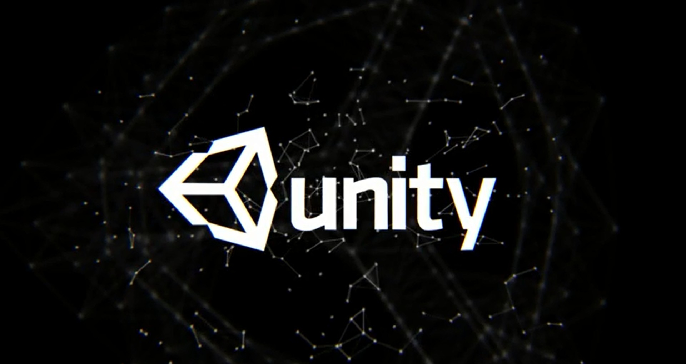

# unity-material-for-spelutveckling
> Bra tutorials och assets för spelutveckling.

## Tutorials

| Channel | Beskrivning |
| ----------- | ----------- |
| Brackeys | [3D FPS Rörelse](https://youtu.be/XAC8U9-dTZU) |
| UnityGuy | [Shooting System](https://youtu.be/u0yksFw9PSs) | 
| Dave     | [Full Fiende AI](https://youtu.be/UjkSFoLxesw) |
| ACDev | [Particle Explosion](https://youtu.be/BXh6LC1H5S0) | 
| pablos lab | [Paus Meny](https://youtu.be/J1x6cSTGQO8) |

## Fonts

| Webbsida | Font |
| ----------- | ----------- |
| DaFont | [Loves](https://www.dafont.com/loves.font) |
| 1001 fonts | [Coolvetica](https://www.1001fonts.com/coolvetica-font.html) | 
| Microsoft     | [Chiller](https://docs.microsoft.com/en-us/typography/font-list/chiller) |
| DaFont | [Cute Notes](https://www.dafont.com/cute-notes.font) | 
| Font Meme | [PentaGram's Selemica](https://fontmeme.com/fonts/pentagram-s-salemica-font/) |

